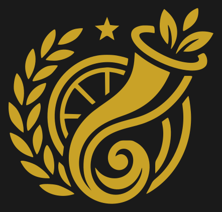
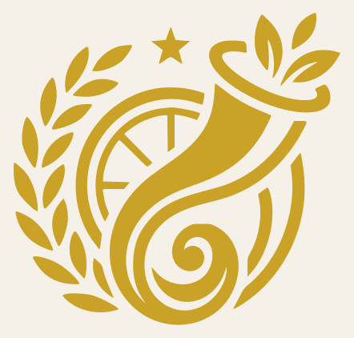
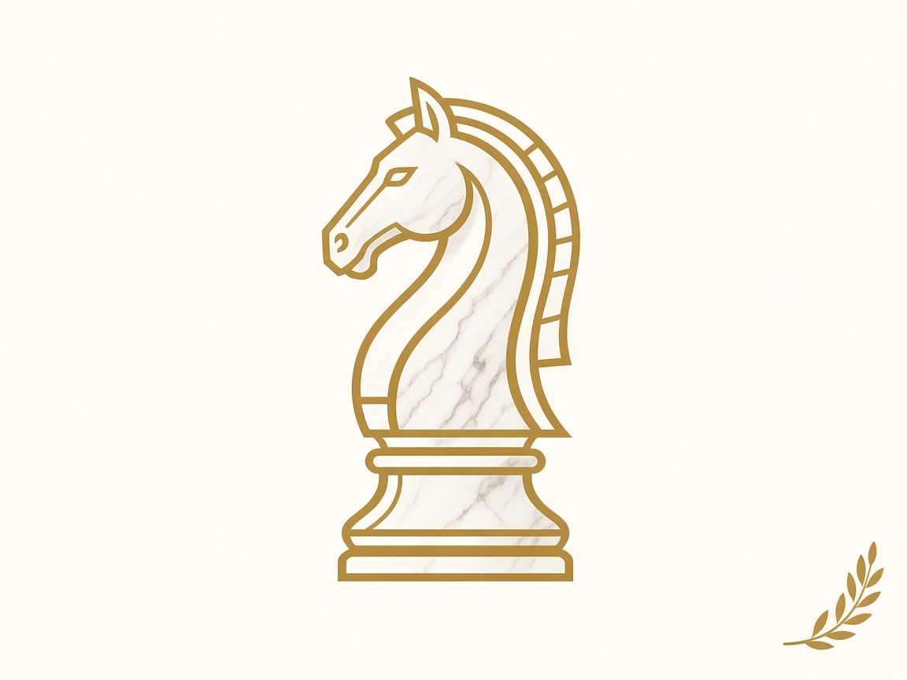
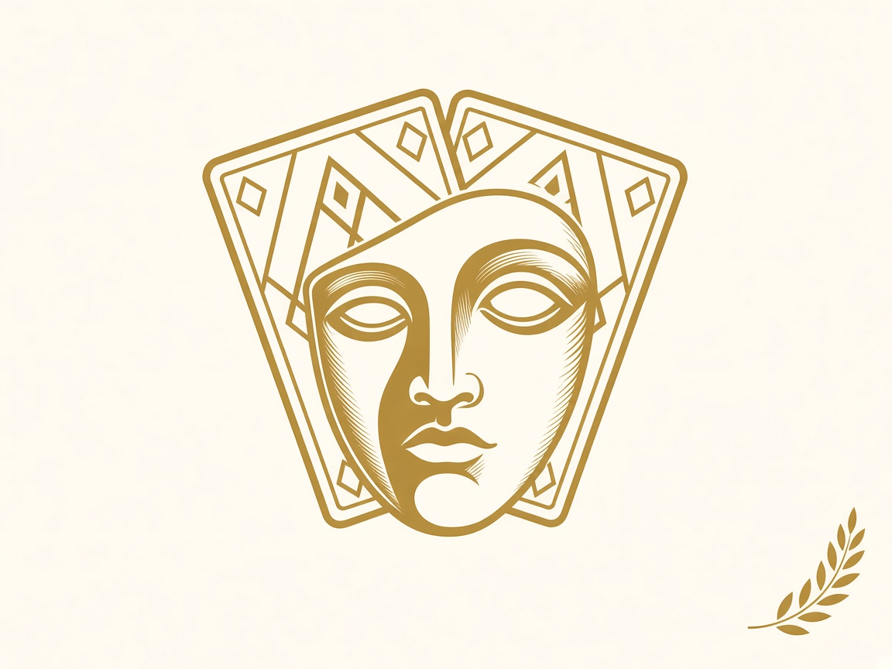
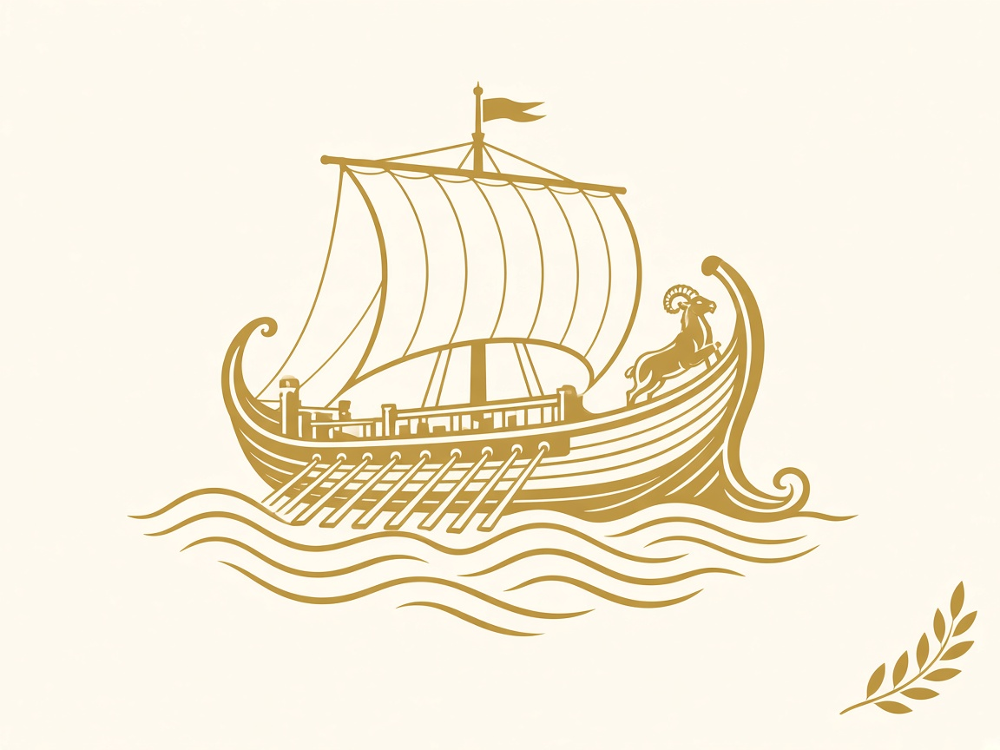

# Visual — Fortuna

Este documento tem duas partes: (1) restrições fixas — o que não fazer, para o site nunca parecer
"gerado por IA sem revisão" — e (2) as decisões visuais confirmadas, que servem de referência para
a implementação do tema no frontend (`frontend/theme/`, quando existir). A primeira rodada de
perguntas foi respondida e está incorporada aqui; novas dúvidas visuais específicas de
implementação continuam indo para `questions.md`.

## 1. Restrições fixas — o que NÃO fazer

Pesquisei os sinais mais comuns que fazem um site parecer "gerado por IA"/"vibe coded" e não
revisado por um humano. Fortuna deve evitar ativamente todos os itens abaixo, em qualquer parte
do site (marketing, salas, jogos, telas de erro):

- **Gradiente roxo/azul** (ou qualquer gradiente forte "genérico") em botões, heróis ou fundos.
  A paleta é branco, preto e dourado (tons sólidos), sem gradiente decorativo.
- **Sombra decorativa (`box-shadow`) pesada/genérica** em cards e botões. Se precisar separar
  camadas visualmente, prefira borda fina, contraste de cor ou espaçamento — não sombra difusa.
- **Cantos arredondados exagerados / pill buttons em tudo.** Definir um raio de borda deliberado
  e usá-lo com moderação, não como default automático em cada elemento.
- **Divs com barra colorida na lateral esquerda** ("card com stripe") — padrão típico de
  dashboard genérico gerado por IA.
- **Ícones/emojis no lugar de conteúdo real.** Preferir imagens (ilustração própria, ver seção 2.5)
  a ícones genéricos de biblioteca (ex.: Lucide, Material Icons default) sempre que o ícone
  estaria substituindo algo que poderia ser uma imagem com significado. Emoji: não usar em nenhum
  lugar do site (nem em textos, nem em UI). Exceção: ícones utilitários pequenos e sem ambiguidade
  (ex.: fechar modal, menu hambúrguer) são aceitáveis quando não há alternativa melhor — mas não
  como "ilustração" de uma feature.
- **Três cards de feature idênticos** (ícone + título + frase, repetido 3x com espaçamento igual)
  como forma de descrever a proposta de valor. Cada jogo tem sua própria identidade visual
  (ver capas em `assets/game-covers/`), não um template genérico repetido.
- **Fonte Inter (ou a fonte default do framework) sem nenhuma escolha deliberada.** Ver 2.4 —
  tipografia já decidida.
- **Copy vago e genérico** ("a melhor plataforma para...", "leve sua experiência ao próximo
  nível", "construa o futuro de..."). Textos devem ser específicos sobre o que o site faz
  (criar sala, jogar Xadrez/Coup/Batalha Naval com amigos) em português direto, sem hipérbole.
- **Travessão em excesso e "confete de em-dash"** em textos de marketing — preferir frases
  diretas e pontuação simples.
- **Aspas retas onde deveriam ser curvas / tipografia não revisada.** Revisar textos finais
  como um editor humano revisaria, não como saída direta de um modelo de linguagem.
- **Testemunhos/depoimentos fabricados** com nomes genéricos ("Usuário Verificado", "Product
  Lead") e avatares placeholder. Não incluir depoimentos até haver depoimentos reais.
- **Bullet points como substituto de texto corrido** em conteúdo de marketing/institucional
  (páginas sobre o produto, "como jogar"). Bullet point é ferramenta para listas genuinamente
  enumeráveis (ex.: regras de um jogo, passos de configuração) — não para descrever a proposta
  de valor do produto, que deve ser prosa.
- **Metadados/SEO deixados no default.** Nunca deixar `<title>` genérico ("My App", "Create Next
  App"), favicon default do framework, ou Open Graph vazio. Todo texto voltado ao público é em
  português do Brasil (ver `.cursor/rules/00-project-context.mdc`).
- **Tema roxo/preto ("dashboard SaaS de IA").** Fora de escopo por completo — a paleta é
  branco/preto/dourado com referência greco-romana, nunca roxo.

## 2. Decisões confirmadas

### 2.1 Logo e identidade

O logo em `architecture_docs/logo.png` é **placeholder** — provavelmente vai mudar, mas segue
como referência de estilo (dourado sobre fundo claro, cornucópia/coroa de louros/estrela/roda)
até uma versão definitiva chegar. Sempre que um arquivo `logo.png` novo for enviado, ele deve
substituir o atual e (quando o frontend existir) ser copiado para `frontend/public/`.

Foi gerada uma **versão vetorizada** (traçado automático a partir do PNG original, cor ajustada
para o dourado confirmado) e uma versão com fundo transparente, disponíveis em
`architecture_docs/assets/logo/`:

- `fortuna-logo.svg` — vetor editável (path único, cor sólida), pronto para favicon/header.
- `fortuna-logo-transparent.png` — versão raster em alta resolução, fundo transparente.
- Confirmado: a logo se destaca mais sobre fundo escuro (grafite), mas funciona nos dois casos —
  por isso as duas versões de preview acima. Versão monocromática (só branco/só preto) não é
  necessária por ora.
- Quando uma logo definitiva for enviada, repetir o processo de vetorização antes de usar em
  produção (favicon, header, Open Graph image).

### 2.2 Paleta de cores — confirmada

Estes valores são a fonte da verdade visual. Quando o frontend existir, eles vivem em um único
lugar no código (`frontend/theme/palette.ts` ou equivalente na config do tema MUI) — nunca
hardcoded em componentes (ver `stack.md` e `.cursor/rules/00-project-context.mdc`).

| Token | Uso | Cor |
|---|---|---|
| `gold` (dourado) | Cor de destaque primária: logo, títulos importantes, CTAs, bordas de ênfase | `#C9A227` |
| `graphite` (preto) | Fundo escuro (headers, seções de destaque), texto principal | `#1A1A1A` |
| `ivory` (branco/off-white) | Fundo claro principal, texto sobre fundo escuro | `#F5F1E8` |
| `wine` (vinho) | Estados de alerta/erro (ex.: xeque no Xadrez, tiro certeiro) | `#7A2E38` |
| `olive` (verde-oliva) | Estados de sucesso/confirmação (ex.: jogada salva, vitória) | `#74804B` |

`wine` e `olive` substituem o vermelho/verde puros para manter a paleta coerente com o tema
clássico, evitando a sensação de "alerta de sistema genérico".

### 2.3 Referências visuais

Referência indicada: um site minimalista, com poucas cores, foco em texto e experiências
interativas, sem parecer produto de IA — a direção geral (pouca cor, tipografia com peso,
espaço em branco generoso, interação como parte do conteúdo, não decoração em cima dele) é a
linha a seguir, adaptada à paleta e ao tema greco-romano de Fortuna.

Referência estética confirmada: **museu/mármore clássico** (textura de pedra, colunas, serifas
elegantes) em vez de "tabuleiro de luxo ornamentado". A mitologia deve estar presente e
reconhecível, mas sem exagerar no realismo — o site precisa ser convidativo mesmo para quem não
conhece mitologia greco-romana a fundo. A sensação de produto premium deve existir, mas de forma
discreta (acabamento, espaçamento, tipografia — não ornamentação pesada).

### 2.4 Tipografia — confirmada

- **Títulos**: [Cormorant](https://fonts.google.com/specimen/Cormorant) — serifada, elegante, com
  referência clássica, sem pesar a leitura.
- **Texto corrido**: [Lora](https://fonts.google.com/specimen/Lora) — serifada também, mas com
  maior legibilidade em blocos de texto e tamanhos menores de UI.

Ambas via Google Fonts, carregadas com `next/font/google` quando o frontend existir (evita layout
shift e não depende de CDN externo em runtime).

### 2.5 Imagens e ilustração — confirmada

Estilo: **ilustração vetorial consistente**, linha em dourado (`#C9A227`) sobre fundo off-white
(`#F5F1E8`), sem gradiente, sombra ou texto embutido na imagem — mesmo estilo do logo, mas sem
depender de ficar visualmente idêntico a ele (a logo é placeholder e pode mudar).

Cada jogo tem uma imagem de capa própria para a tela de seleção de jogos dentro da sala. Primeira
versão gerada, em `architecture_docs/assets/game-covers/`:

Essas três imagens são a primeira iteração e servem de referência de estilo (linha dourada,
motivo de coroa de louros no canto, fundo sólido, uma referência greco-romana por jogo — cavalo
de mármore para Xadrez, máscara de teatro para Coup, trirreme para Batalha Naval). Podem ser
refinadas depois, mas já são utilizáveis no scaffold do frontend.

### 2.6 Tom de voz — confirmado

Equilíbrio com predominância **direta e neutra** no dia a dia (instruções, botões, mensagens de
erro: "Convide seus amigos com o link da sala"). O tom mais **solene/mitológico** fica reservado
para poucos momentos de destaque — CTAs específicos, títulos de maior peso — não para o texto
corrido em geral. Ou seja: solenidade é tempero, não a base.

### 2.7 A "sala pixel art" (visão futura)

Confirmado como visão futura, fora do MVP. Documentado em `idea.md`; visual só será definido
quando a funcionalidade entrar em roadmap ativo.

## 3. Como isso chega no código

Quando o scaffold do frontend for criado (Fase 0 do `mvp.md`), a paleta da seção 2.2 e as fontes
da seção 2.4 devem ser configuradas no tema do MUI (`createTheme`) como a única fonte de verdade
visual — nenhum componente deve declarar cor ou fonte diretamente. Os assets desta pasta
(`architecture_docs/assets/`) devem ser copiados para `frontend/public/images/` na mesma tarefa.
